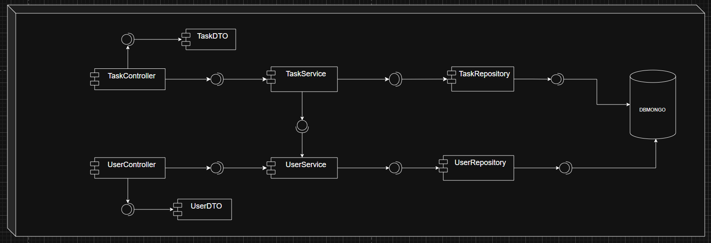
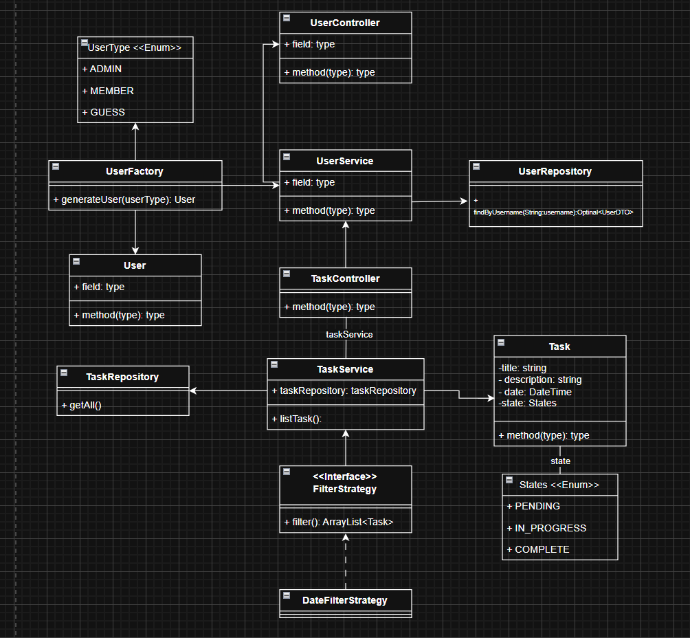

# Taller evaluativo segundo tercio de DOSW.
___
## **Integrantes** 
* Carolina Cepeda Valencia
* Manuel Alejandro Guarnizo
* Daniel Palacios Moreno
* Sofia Nicolle Ariza Goenaga
* Marlio Jose Charry Espitia

## Descripción del enunciado
Una startup quiere desarrollar un Gestor de Tareas Colaborativo. Este
sistema permite crear tareas (título, descripción, fecha y estado), listar todas las tareas, filtras las tareas completadas 
y persistir los datos en MongoDB.

##  Descripción del Proyecto
Una startup quiere desarrollar un Gestor de Tareas Colaborativo. Este sistema permitirá a los usuarios crear, asignar y realizar seguimiento de tareas en un entorno colaborativo, con diferentes roles de usuario y funcionalidades específicas para cada uno.

##  Flujo de Ramas
El proyecto sigue el siguiente flujo de ramas:

```
main
  └── develop
      ├── feature/feature-name
```

### Convención de Nombres de Ramas
- `feature/`: Para nuevas funcionalidades

### Convención de Commits
- `feat:` Nueva funcionalidad
- `fix:` Corrección de errores
- `docs:` Actualización de documentación

## Diagrama de Componentes


### Componentes Principales

1. **Controladores (Controllers)**
   - `TaskController`: Maneja todas las peticiones HTTP relacionadas con tareas
     - Endpoints para CRUD de tareas
     - Filtrado por estado, palabra clave y fecha
   - `UserController`: Gestiona las operaciones de usuarios
     - Creación y consulta de usuarios
     - Manejo de diferentes roles (Admin, Member, Guest)

2. **Modelos (Models)**
   - `Task`: Entidad principal que representa una tarea
   - `User`: Clase base para usuarios
   - `AdminUser`, `MemberUser`, `GuestUser`: Implementaciones específicas de usuarios
   - `States`: Enumeración para los estados de las tareas

3. **Servicios (Services)**
   - `TaskService`: Implementa la lógica de negocio para tareas
   - `UserService`: Maneja la lógica de negocio para usuarios
   - `UserFactory`: Implementa el patrón Factory para crear diferentes tipos de usuarios
   - `FilterStrategy`: Interfaz base para las estrategias de filtrado
     - `StatusFilterStrategy`: Filtra tareas por estado
     - `KeyWordFilterStrategy`: Filtra tareas por palabra clave
     - `DateFilterStrategy`: Ordena tareas por fecha

4. **Repositorios (Repositories)**
   - `TaskRepository`: Interfaz para acceder a los datos de tareas en MongoDB
   - `UserRepository`: Interfaz para acceder a los datos de usuarios en MongoDB

5. **DTOs (Data Transfer Objects)**
   - `TaskDTO`: Objeto para transferir datos de tareas entre capas
   - `UserDTO`: Objeto para transferir datos de usuarios entre capas

6. **Utilidades**
   - `ResponseHandler`: Maneja las respuestas HTTP estandarizadas
   - `GlobalExceptionHandler`: Manejo centralizado de excepciones

## Diagrama de Clases


### Patrones de Diseño Implementados

#### 1. Factory Method
Se utiliza para la creación de diferentes tipos de usuarios:
- `UserFactory` es una clase que implementa el patrón Factory Method
- Crea instancias de diferentes tipos de usuarios (`AdminUser`, `MemberUser`, `GuestUser`) basado en un DTO
- Maneja la validación de tipos de usuario y asigna el ID si está presente

#### 2. Strategy
Se aplica para los diferentes algoritmos de filtrado de tareas:
- `FilterStrategy` es la interfaz común
- `StatusFilterStrategy`, `KeywordFilterStrategy` y `DateFilterStrategy` son implementaciones concretas

## Principios SOLID

### 1. Principio de Responsabilidad Única (SRP)
- Cada clase tiene una única responsabilidad bien definida
- Ejemplo: `TaskService` maneja la lógica de negocio de tareas, mientras que `UserService` se ocupa de la gestión de usuarios

### 2. Principio Abierto/Cerrado (OCP)
- El sistema permite extender su comportamiento sin modificar el código existente
- Ejemplo: Se pueden añadir nuevos filtros implementando la interfaz `FilterStrategy`

### 3. Patrones de Diseño Implementados

#### Strategy Pattern
- Se utiliza para implementar diferentes estrategias de filtrado de tareas
- Interfaz: `FilterStrategy`
- Implementaciones:
  - `StatusFilterStrategy`: Filtra tareas por estado
  - `KeyWordFilterStrategy`: Filtra tareas por palabra clave en el título
  - `DateFilterStrategy`: Ordena tareas por fecha

#### Factory Pattern
- `UserFactory`: Se encarga de la creación de diferentes tipos de usuarios
  - Crea instancias de diferentes tipos de usuarios basado en el DTO proporcionado
  - Maneja la lógica de creación centralizada para los usuarios

### 4. Estructura del Proyecto
- `controller`: Maneja las peticiones HTTP
- `model`: Contiene las entidades del dominio
- `dto`: Objetos de transferencia de datos
- `repository`: Acceso a datos
- `services`: Lógica de negocio
- `strategies`: Implementaciones de estrategias de filtrado
- `exception`: Manejo de excepciones

### 5. Consideraciones de Diseño
- Las validaciones se realizan en los controladores
- Los servicios contienen la lógica de negocio principal
- Se utilizan DTOs para la transferencia de datos entre capas
- Las excepciones personalizadas mejoran el manejo de errores

## Instalación

### Requisitos Previos
- Java 17 o superior
- Maven
- MongoDB

### Configuración de la Base de Datos

#### Opción 1: Instalar MongoDB Localmente
1. Descargar e instalar MongoDB Community Server desde: [https://www.mongodb.com/try/download/community](https://www.mongodb.com/try/download/community)
2. Iniciar el servicio de MongoDB:
   - Buscar "Services" en el menú de inicio y asegurarse de que el servicio "MongoDB" esté en ejecución
3. Verificar la instalación ejecutando `mongod --version`

#### Opción 2: Usar Docker
1. Instalar Docker Desktop desde: [https://www.docker.com/products/docker-desktop/](https://www.docker.com/products/docker-desktop/)
2. Ejecutar MongoDB en un contenedor:
   ```bash
   docker run --name mongodb -p 27017:27017 -d mongo:latest
   ```

### Configuración del Proyecto

1. Clonar el repositorio:
   ```bash
   git clone https://github.com/carolina-cepeda/taller2DOSW2
   cd taller2DOSW2
   ```

2. Compilar el proyecto:
   ```bash
   mvn clean compile
   ```

3. Ejecutar la aplicación:
   ```bash
   mvn spring-boot:run
   ```

4. La aplicación estará disponible en: [http://localhost:8080](http://localhost:8080)

```properties
# Configuración de MongoDB
spring.data.mongodb.host=localhost
spring.data.mongodb.port=27017
spring.data.mongodb.database=taller2dosw

# Configuración del servidor
server.port=8080
```

## Ejecución de Tests

El proyecto incluye pruebas unitarias y de integración que puedes ejecutar de las siguientes maneras:

### Ejecutar todos los tests
```bash
mvn test
```

### Generar reporte de cobertura
```bash
mvn jacoco:report
```
El reporte de cobertura estará disponible en: `target/site/jacoco/index.html`
Al hacer el reporte de jacoco, puedes verlo ejecutando:
```bash
start target\site\jacoco\index.html
```